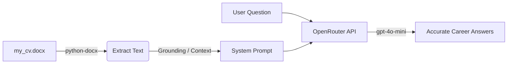

<div align="center">

# ﷽
### ﴿ وَقُل رَّبِّ زِدْنِي عِلْمًا ﴾

<br/>

# 📄 Chat With CV (AI Career Assistant)
An intelligent interactive AI Agent that ingests your CV/Resume from a Word document (`.docx`) and accurately answers queries about your career, skills, and work history using prompt grounding.

---

</div>

## 📌 Project Overview

This project is part of building foundational skills in **AI Agents & LLM Integration**. It demonstrates how to bring external private context (your CV) directly into a Large Language Model (LLM) using prompt grounding/context injection, enabling a real-time conversational agent.

---

## 🚀 How It Works & Architecture

<div align="center">
  
</div>

<br/>



1. **Environment Setup & Key Protection (`os` & `dotenv`):**
   * Securely loads API credentials from a local `.env` file using `load_dotenv()` without hardcoding secrets in the codebase.
2. **Document Parsing (`python-docx`):**
   * Reads all paragraphs from `my_cv.docx` and concatenates them into a clean, formatted text string.
3. **Context Injection (Grounding the Agent):**
   * Injects the parsed CV text directly into the `system_prompt` (`role: "system"`), setting strict boundaries and role instructions for the AI model.
4. **Chat Completion Loop (`OpenAI` Client with `OpenRouter`):**
   * Runs an interactive terminal loop waiting for user queries.
   * Sends structured `messages` to OpenRouter (`base_url="https://openrouter.ai/api/v1"`) running `openai/gpt-4o-mini`.
   * OpenRouter validates the API key and routes the request to the `gpt-4o-mini` model.
   * Extracts the text response via `response.choices[0].message.content`.

---

## 🛠️ Tech Stack & Libraries

| Library / Tool | Purpose |
| :--- | :--- |
| **`python-docx`** | Extracting text content and structure from `.docx` files |
| **`python-dotenv`** | Managing environment variables and secret API keys securely |
| **`openai` Python SDK** | Interfacing with LLM endpoints (`ChatCompletions`) |
| **`OpenRouter`** | Unified API routing to access `openai/gpt-4o-mini` |

---

## 📦 Getting Started & Usage

### 1. Clone the repository
```bash
git clone https://github.com/your-username/chat-with-cv.git
cd chat-with-cv
```

### 2. Install dependencies
```bash
pip install -r requirements.txt
```

### 3. Setup Environment Variables
Create a `.env` file in the root directory:
```env
OPEN_AI_API_KEY=your_openrouter_or_openai_api_key_here
```

### 4. Choose How You Want to Run

> 📖 **لو عاوز تفهم وتتعلم التفاصيل خطوة بخطوة:**  
> افتح دفتر الجوبيتر [`chat_with_cv.ipynb`](chat_with_cv.ipynb):
> ```bash
> jupyter notebook chat_with_cv.ipynb
> ```
>
> ⚡ **لو عاوز تشغّل الكود مباشرة وسريعاً:**  
> شغّل ملف بايثون [`chat_with_cv.py`](chat_with_cv.py):
> ```bash
> python chat_with_cv.py
> ```

---

## 💡 Key Lessons Learned & Best Practices

* **API Base Routing:** When using keys from providers like **OpenRouter**, configure `base_url="https://openrouter.ai/api/v1"` inside `OpenAI(...)` to prevent default routing errors (`401 Unauthorized`).
* **Prompt Grounding:** Providing document context inside the `system` role keeps the model truthful and minimizes hallucinations when discussing specialized private data.
* **Separation of Concerns:** Keep raw document processing isolated from the LLM invocation logic for modularity.

---

## دعاء 

<div dir="rtl" align="center">

> ### 🤲 الرجاء الدعاء لأبي وأمي وكل من تعلمت منه حرفا، ولإخواننا المستضعفين في كل بقاع الأرض أن يفرّج الله كروبهم، وينصرهم، ويثبّت أقدامهم.

</div>

